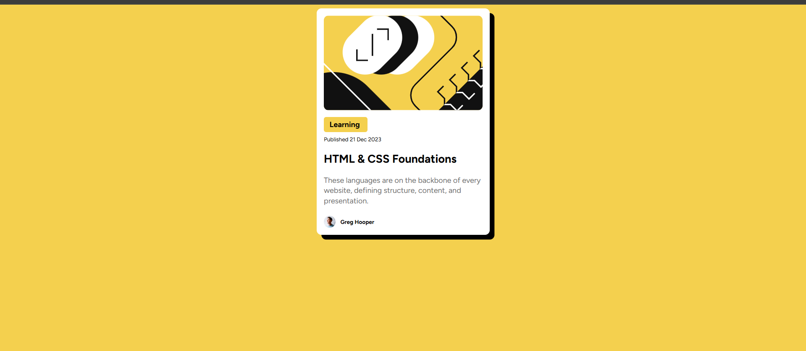
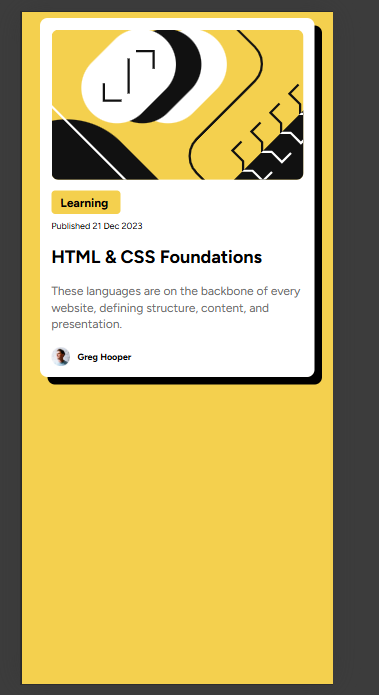
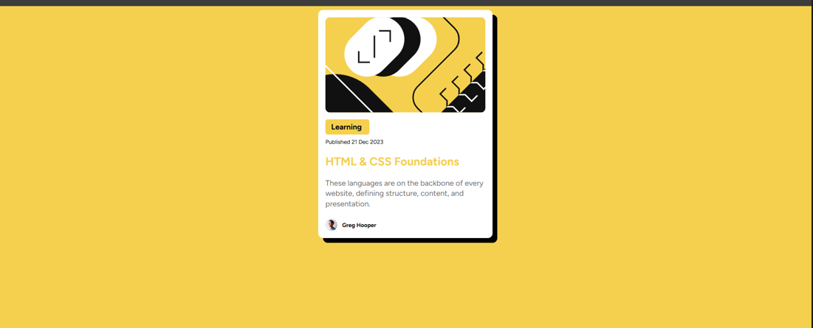

# My Blog Project

Hi! I’m a beginner web developer, and this is my first blog project. I’m still learning, so some of my code might not be the most efficient, but I’m excited to keep improving! 🚀

## Preview
Here’s a quick preview of my blog:

> Note: This screenshot shows how my blog looks locally.  

## Live Site
You can check out the live version here:  
[My Blog Live](https://princearvildean.github.io/Practice-Projects/)

## Features
- Simple blog layout with HTML and CSS  
- Styled content with external CSS  
- Responsive design (works on different screen sizes)  

## About Me
I’m learning web development step by step. I hope to improve my skills and make more interactive and efficient websites in the future.  

*Thank you for checking out my project! Any feedback is appreciated.*
